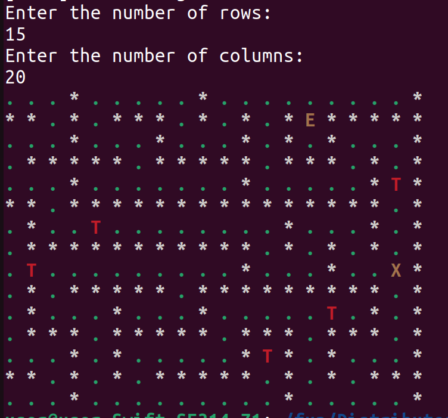
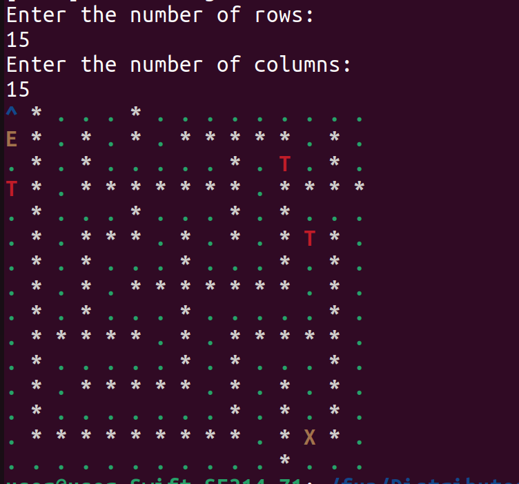

# Maze

A C++ program that generates a random maze of a given size.

Here are some of the results:





I use a dfs approach to create a random maze. Thus, time complexity is O(n * m).
The maze is represented as a 2D vector of integers, where each cell can have one of the following values:

UNVISITED: Represents an unvisited cell.

ROAD: Represents a walkable cell. (.)

WALL: Represents a wall. (#)

ENTRANCE: Represents the entrance to the maze. (E)

EXIT: Represents the exit of the maze. (X)

TREASURE: Represents a treasure cell. (^)

TRAP: Represents a trap cell. (T)

### Usage

1. Clone the repository:

```bash
https://github.com/zepif/Distributed_Lab_Challenge.git

cd 'Task #2. Maze'
```

2. Build the project using CMake:

```bash
mkdir build

cd build

cmake ..

make
```

3. Run the compiled executable:

```bash
./Maze
```

### Time Spent

I spent about 4.5 hours solving this problem

