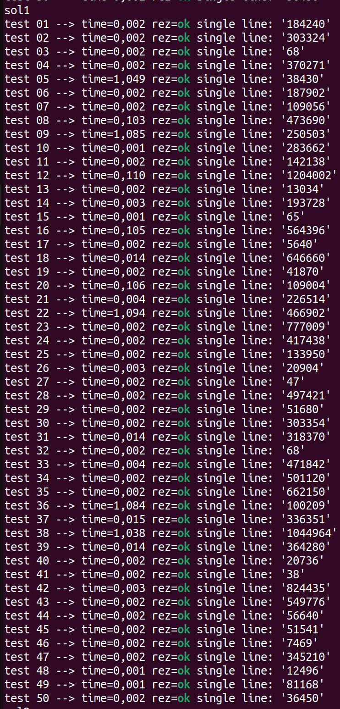

# Task #7. Pinatas

This is a console application that solves the Pinatas task. Also was created scripts to generate tests to validate the
solution.

### Structure

- `./sols/sol.cpp` : Main solution. In this solution was used dynamic programming.

Main idea of the solution is that if we break the i-th pinata, then there is no point in considering i-1 and i+1, since the product will be 0 anyway

Therefore the dp looks like this:

`dp[n][2]` -- where [n] - number of elements; [2] - whether we smash this element or not. In my solution [0] - we
dont smash i-th element, [1] - smash

Then the basis of the dynamics is obvious:

dp[0][0] = 0

dp[0][1] = a[0] * a[1]


The transition of dynamics looks like this:

dp[i][0] = max(dp[i-1][0], dp[i-1][1]): The maximum number of candies obtained if the i-th pinata is not smashed is the maximum of the maximum number of candies obtained if the (i-1)-th pinata is not smashed and the maximum number of candies obtained if the (i-1)-th pinata is smashed.

dp[i][1] = dp[i-1][0] + a[i-1] * a[i] * a[i+1]: The maximum number of candies obtained if the i-th pinata is smashed is the maximum number of candies obtained if the (i-1)-th pinata is not smashed, plus the number of candies obtained by smashing the i-th pinata.

The final answer is the maximum of dp[n-1][0] and dp[n-1][1]

The result of my solution: 


- `./sols/tl.cpp` : A naive solution that implements the enumeration of all possible smashes. I made this solution
for generating small tests, since it is the simplest and easiest solution, it is perfect for generating tests.

The result of my naive solution: 

You can see that it works much slower, than main solution


- `./sols/chatgpt_sol.cpp` : Chatagpt Solution. I made it to make sure it wouldn't pass all the tests and I generated
them correctly.

The result of gpt solution: 


- `./gentests/generator.cpp` : C++ program, which generates one random test

- `./gentests/gen.sh` : Bash script which compiles naive solution & generator. Then sends the generated test to the solution and saves the test in the ./tests folder

- `./checker` : Contains checker, which compares the result of the programme and the correct output using testlib library

- `compilechecker.sh` : Compiles the checker before using it. After compiling the checker you should use `checkprob.sh` to run the solutions through the tests

- `tests/ptest.sh` : Outputs generated tests.

### Usage

Firstly, you need to clone the repository:

```bash
https://github.com/zepif/Distributed_Lab_Challenge.git

cd 'Task #7. Pinatas'
```

Use `g++ -o sol ...` to compile one of the solutions. Then use other bash scripts as described.

### Time Spent

I spent about 40 minutes solving this problem
