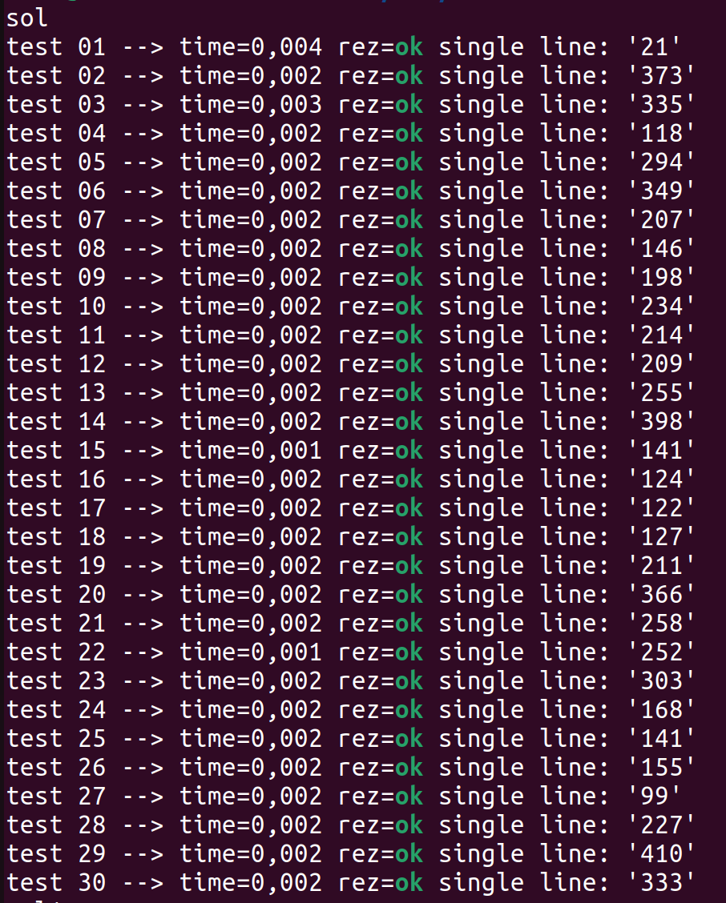
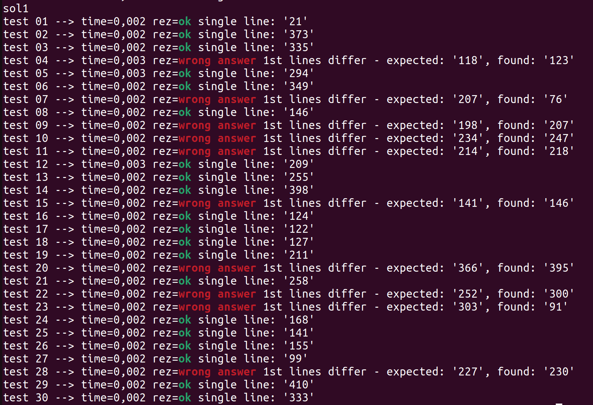

# Task #8. Student’s capital

This is a console application that solves the Student’s capital task. Also was created scripts to generate tests to validate the
solution.

### Structure

- `./sols/sol.cpp` : Main solution. In this solution was used priority queue.

The solution algorithm is to first sort all laptops by their price. Then buy the most profitable laptops until we can't buy the i-th one. If we can buy any laptop and we have bought less than n, then we just buy the remaining most profitable ones. The asymtotics of this solution is O(n * log(n)) in time, since we add n times to the priority queue

The result of my solution: 


- `./sols/chatgpt_sol.cpp` : Chatagpt Solution. I made it to make sure it wouldn't pass all the tests and I generated
them correctly.

The result of gpt solution: 


- `./gentests/generator.cpp` : C++ program, which generates one random test

- `./gentests/gen.sh` : Bash script which compiles naive solution & generator. Then sends the generated test to the solution and saves the test in the ./tests folder

- `./checker` : Contains checker, which compares the result of the programme and the correct output using testlib library

- `compilechecker.sh` : Compiles the checker before using it. After compiling the checker you should use ``checkprob.sh`` to run the solutions through the tests

- `tests/ptest.sh` : Outputs generated tests.

### Usage

Firstly, you need to clone the repository:

```bash
https://github.com/zepif/Distributed_Lab_Challenge.git

cd 'Task #8. Student’s capital'
```

Use `bash g++ -o sol ...` to compile one of the solutions. Then use other bash scripts as described.

### Time Spent

I spent about 1.5 hours solving this problem
